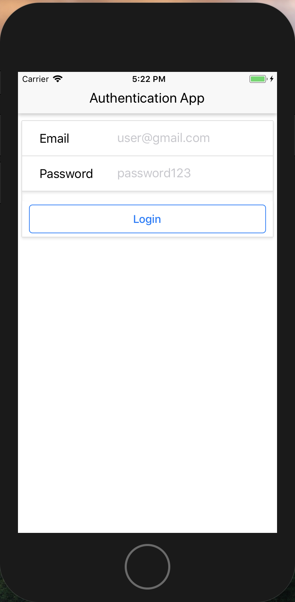
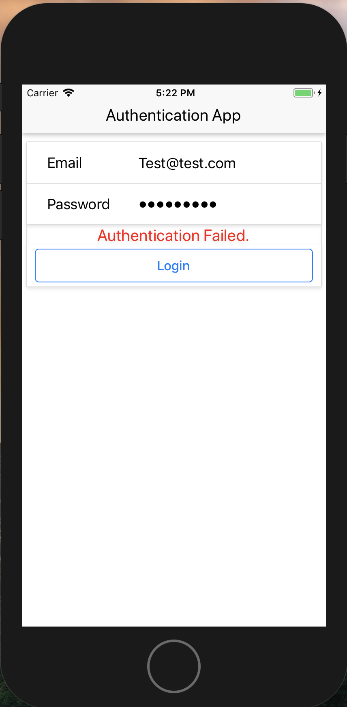
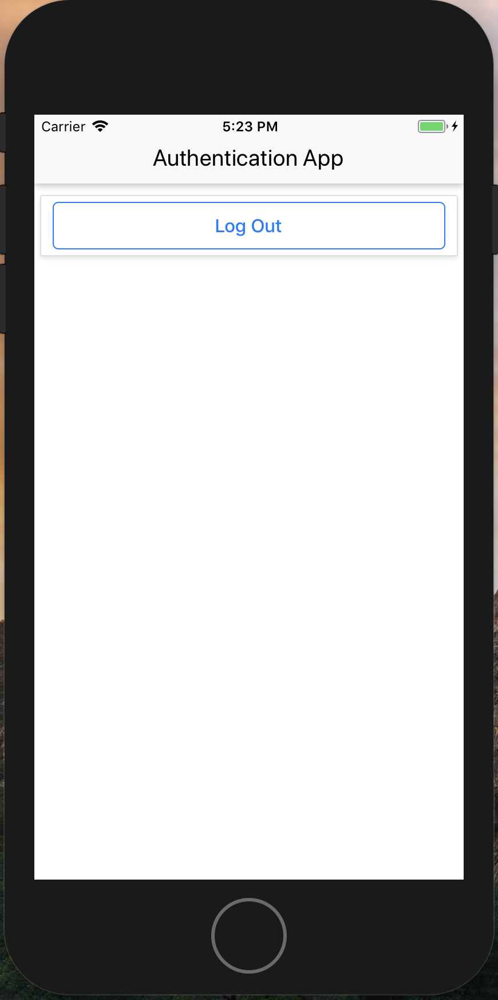

# Auth_iOSapp-React-Native-
Basic React-Native Auth app using email and password

# Purpose 

* I created this app to practice React-Native and Firebase Auth

## App Functionality:

- This is a basic authentication app
- You can log in and out, and all components are made to be reusable for other apps

- (Login and Logout components)
  - If you use a new email address, your account will be created
  - If you use an existing email address with the incorrect password, you will see an error
  - If you use an existing email address with correct password, you will be logged in

  - Once logged in, there is only a log out button

### Screenshots:

- (incorrect password:)

- (after logged in succesfully:)

